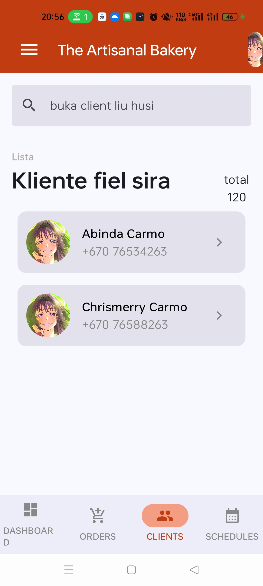

# OrderManagementCake
<p align="center">
  
</p>

<p align="center">
  <a href="https://visitorbadge.io/status?path=Noro18%2FCakeOrder">
    
  </a>
</p>

*(Tetum iha kraik)*

A basic Android application for managing cake orders, built with modern Android development practices.

## Description

OrderManagementCake is an Android application designed to help users (likely bakery owners or staff) manage cake orders efficiently. The app provides a streamlined interface to track orders, manage customer details, and keep track of delivery schedules.

## Features (Planned)

*   **Order Tracking:** Create, edit, and view cake orders.
*   **Customer Management:** Maintain a list of customers and their contact information.
*   **Cake Customization Details:** Record specific requirements for each cake (flavor, size, decorations, etc.).
*   **Status Management:** Track the progress of orders (e.g., Pending, Baking, Ready for Delivery, Delivered).
*   **Delivery Schedule:** View upcoming deliveries in a clear list or calendar view.

## Project Status & Implementation

Currently, the application has the following implemented:

*   **Navigation:** Uses **Jetpack Navigation Compose**. The `AppNavHost` (in `NavGraph.kt`) manages the app's navigation and structure.
*   **Unified UI Structure:** A single `Scaffold` in `AppNavHost` contains a common `AppTopBar` and `BottomNavigationBar`. Only the main content area swaps when navigating between screens, making the app feel smoother.
*   **Screens:**
    *   **Order List Screen:** Displays a summary of current orders. Includes a search bar and filter chips (All, Pending, In Progress, etc.) to quickly find specific orders.
    *   **Client List Screen:** Displays a directory of "Loyal Patrons". Includes a search bar and shows client contact details.
*   **MVVM Structure:** The project folder structure is organized according to MVVM, although Data layers (Room, Repositories) and ViewModels are currently in the placeholder stage.

---

## Status Projetu & Implementasaun

Atualmente, aplikasaun ne'e implementa ona buat hirak tuir mai ne'e:

*   **Navigasaun:** Uza **Jetpack Navigation Compose**. `AppNavHost` (iha `NavGraph.kt`) mak jere navigasaun no estrutura aplikasaun nian.
*   **Estrutura UI Unifikadu:** `Scaffold` ida deit iha `AppNavHost` ne'ebé kontein `AppTopBar` no `BottomNavigationBar` ne'ebé hanesan ba screen hotu. Só área konteúdu mak troka wainhira halo navigasaun, halo aplikasaun ne'e sente moos liu (smooth).
*   **Screen sira:**
    *   **Order List Screen:** Hatudu sumáriu pedidu sira nian. Inclui search bar no filter chips (All, Pending, In Progress, nst) atu buka pedidu sira ho lalais.
    *   **Client List Screen:** Hatudu direktóriu "Loyal Patrons". Inclui search bar no hatudu detallu kontaktu kliente sira nian.
*   **Estrutura MVVM:** Estrutura folder projetu nian organiza tuir MVVM, maske layer Data (Room, Repositories) no ViewModels sei iha hela deit faze placeholder nian.

## Tech Stack

*   **Language:** [Kotlin](https://kotlinlang.org/)
*   **UI Framework:** [Jetpack Compose](https://developer.android.com/jetpack/compose)
*   **Architecture:** Follows modern Android Architecture Components (planned).
*   **Build System:** Gradle (Kotlin DSL)
*   **Minimum SDK:** 24
*   **Target SDK:** 36

## Architecture
checkout [Archictecture and File structure](docs/ARCHITECTURE.md) for a more detailed explanation about the architecture 

## Getting Started

### Prerequisites

*   Android Studio Ladybug or newer.
*   JDK 11 or higher.

### Installation

1.  Clone the repository:
    ```bash
    git clone https://github.com/yourusername/OrderManagementCake.git
    ```
2.  Open the project in Android Studio.
3.  Sync the project with Gradle files.
4.  Run the app on an emulator or a physical device.


### CONTRIBUTION

For contribution guidance checkout out [Contribution guidance](docs/CONTRIBUTION.md)

## License

This project is licensed under the MIT License - see the [LICENSE](LICENSE) file for details (if applicable).

---

# OrderManagementCake (Tetum)

Aplicasaun Android báziku ida atu jere pedidu bolu (cake orders), harii ho prátika dezenvolvimentu Android modernu.

## Deskrisaun

OrderManagementCake mak aplicasaun Android ida ne'ebé dezenvolve atu ajuda uza-na'in (hanesan na'in ba padaria ka funsionáriu) atu jere pedidu bolu sira ho efisiente. Aplicasaun ne'e fornese interface ida ne'ebé simples atu kontrola pedidu, jere detallu kliente sira, no kontrola oráriu entrega sira.

## Funsaun sira (Planeadu)

*   **Kontrola Pedidu:** Kria, edita, no haree pedidu bolu sira.
*   **Jere Kliente:** Mantein lista kliente sira no sira-nia informasaun kontaktu.
*   **Detallu Personalizasaun Bolu:** Rejista rekerimentu espesífiku ba bolu ida-idak (sabor, medida, dekorasaun, nst).
*   **Jere Status:** Kontrola progresu pedidu sira (ezemplu: Hein hela, Te'in hela, Prontu atu Entrega, Entrega ona).
*   **Oráriu Entrega:** Haree entrega sira ne'ebé sei mai iha lista ne'ebé klaru ka vizaun kalendáriu.

## Teknolojia ne'ebé Uza

*   **Lian:** [Kotlin](https://kotlinlang.org/)
*   **UI Framework:** [Jetpack Compose](https://developer.android.com/jetpack/compose)
*   **Arkitetura:** Tuir Komponente Arkitetura Android modernu (planeadu).
*   **Sistema Build:** Gradle (Kotlin DSL)
*   **SDK Mínimu:** 24
*   **SDK Alvu:** 36

## Arkitetura
haree [Arkitetura no Estrutura File](docs/ARCHITECTURE.md) ba esplikasaun detalladu liu kona-ba arkitetura.

## Hahú Prosesu

### Pre-rekizitu sira

*   Android Studio Ladybug ka foun liu.
*   JDK 11 ka aas liu.

### Instalasaun

1.  Clone repozitóriu:
    ```bash
    git clone https://github.com/yourusername/OrderManagementCake.git
    ```
2.  Loke projetu iha Android Studio.
3.  Sincroniza projetu ho file Gradle sira.
4.  Hala'o aplicasaun iha emulador ka dispozitivu fíziku.


### KONTRIBUISAUN

Ba guia kontribuisaun, haree [Guia Kontribuisaun](docs/CONTRIBUTION.md).

## Lisensa

Projetu ne'e lisensiadu okos Lisensa MIT - haree file [LICENSE](LICENSE) ba detallu sira (se iha).

## PR test

Review code ida ne'e no approve ou karik hakarak muda baut ruma reqeust changes
Depois de comment hotu resolve comment foin merge bele unblock 