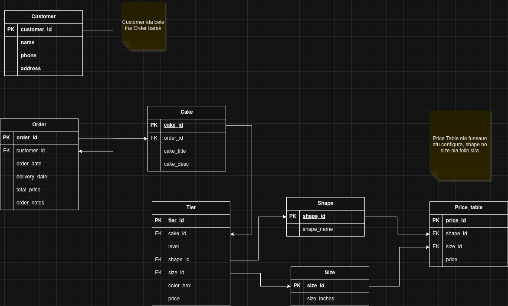

# Cake Order Management App — Database Schema

  

## Overview

This is a mobile app for managing cake orders. A customer places an order, each order can contain multiple cakes, each cake has multiple tiers stacked bottom to top, and each tier has its own shape, size, color, and price.

---

## Entities

### CUSTOMER

Stores the people who place orders.

| Column  | Type   | Key |
| ------- | ------ | --- |
| id      | uuid   | PK  |
| name    | string |     |
| phone   | string |     |
| address | string |     |

---

### ORDER

Represents one customer agreement — one pickup/delivery event.

| Column        | Type    | Key           |
| ------------- | ------- | ------------- |
| id            | uuid    | PK            |
| customer_id   | uuid    | FK → CUSTOMER |
| order_date    | date    |               |
| delivery_date | date    |               |
| total_price   | decimal |               |
| order_notes   | string  |               |
| status | enum | pending, in_progress, ready, completed, cancelled |

---

### CAKE

One order can have multiple cakes (e.g. a customer orders 2 cakes for twins).

| Column     | Type   | Key        |
| ---------- | ------ | ---------- |
| cake_id    | uuid   | PK         |
| order_id   | uuid   | FK → ORDER |
| cake_title | string |            |
| cake_notes | string |            |

---

### TIER

Each cake has multiple tiers stacked from bottom (level 1) to top. Price is snapshotted at order time from PRICE_TABLE.

| Column    | Type    | Key                          |
| --------- | ------- | ---------------------------- |
| tier_id   | uuid    | PK                           |
| cake_id   | uuid    | FK → CAKE                    |
| level     | int     |                              |
| shape_id  | uuid    | FK → SHAPE                   |
| size_id   | uuid    | FK → SIZE                    |
| color_hex | string  | e.g. #FF0000                 |
| price     | decimal | snapshotted from PRICE_TABLE |

---

### SHAPE *(config)*

Predefined list of cake shapes. Set up once by the admin.

| Column     | Type   | Key                          |
| ---------- | ------ | ---------------------------- |
| shape_id   | uuid   | PK                           |
| shape_name | string | e.g. circle, square, hexagon |

---

### SIZE *(config)*

Predefined list of cake sizes. Set up once by the admin.

| Column  | Type    | Key               |
| ------- | ------- | ----------------- |
| size_id | uuid    | PK                |
| inches  | decimal | e.g. 6, 8, 10, 12 |

---

### PRICE_TABLE *(config)*

Maps every Shape + Size combination to a price. Looked up at order time to snapshot the price onto each Tier.

| Column   | Type    | Key        |
| -------- | ------- | ---------- |
| price_id | uuid    | PK         |
| shape_id | uuid    | FK → SHAPE |
| size_id  | uuid    | FK → SIZE  |
| price    | decimal |            |

---

## Relationships

| From     | To          | Type        | Description                         |
| -------- | ----------- | ----------- | ----------------------------------- |
| CUSTOMER | ORDER       | one to many | one customer can place many orders  |
| ORDER    | CAKE        | one to many | one order can contain many cakes    |
| CAKE     | TIER        | one to many | one cake has many tiers             |
| TIER     | SHAPE       | many to one | each tier has one shape             |
| TIER     | SIZE        | many to one | each tier has one size              |
| SHAPE    | PRICE_TABLE | one to many | a shape appears in many price rules |
| SIZE     | PRICE_TABLE | one to many | a size appears in many price rules  |

---

## Key Design Decisions

- **No COLOR table** — color is stored directly on TIER as a hex string (`color_hex`). A color picker in the UI enforces valid hex format.
- **Price is snapshotted** — `TIER.price` is copied from `PRICE_TABLE` at order time so future price changes don't affect old orders.
- **CAKE is its own entity** — because one order can contain multiple cakes.
- **Shape lives on TIER not CAKE** — because mixed-shape cakes exist (e.g. square bottom tier, circle top tier).
- **Notifications are not an entity** — delivery reminders are a behavior triggered by `ORDER.delivery_date`, not stored data.

